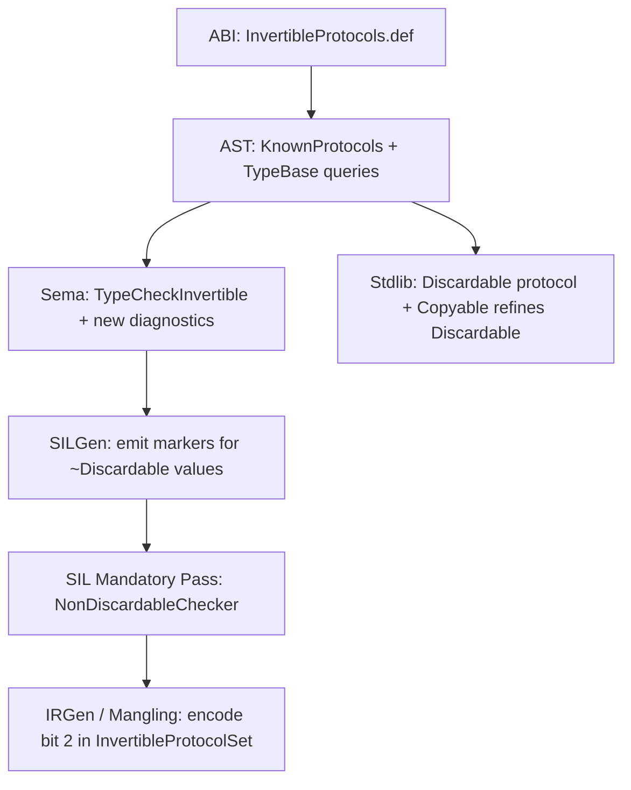
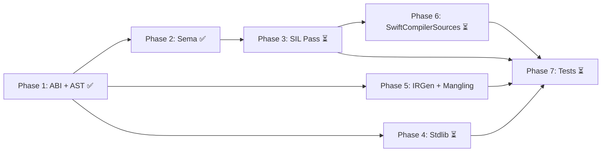

# Implementation Plan: `~Discardable` — Strict Linear Types

## Overview

This plan details every compiler and stdlib change required to implement the `~Discardable` proposal. The design follows the exact same pattern as `~Copyable` / `~Escapable` — a new **invertible protocol** — but adds a novel **SIL-level enforcement pass** that ensures `~Discardable` values are explicitly consumed on all paths.

A key design decision: **`Copyable` refines `Discardable`** in the standard library. This means:
- Every `Copyable` type is automatically `Discardable`
- Writing `~Discardable` automatically implies `~Copyable` (through the inverse implication chain)
- Users only need to write `struct Foo: ~Discardable {}` — the `~Copyable` is inferred



---

## Implementation Status

| Phase | Status | Notes |
|-------|--------|-------|
| Phase 1 — ABI & AST Foundation | ✅ DONE | Compiler builds, all .def files updated |
| Phase 1.5 — Stdlib Discardable protocol | ✅ DONE | Protocol defined, Copyable refines Discardable |
| Phase 2 — Sema type-checking | ✅ DONE | ~Discardable → ~Copyable implication works |
| Phase 2.8 — Smoke test passing | ✅ DONE | `test/Sema/nondiscardable_smoke.swift` passes |
| Phase 3a — SIL pass: local scope checking | ✅ DONE | NonDiscardableChecker pass, comprehensive test suite passes |
| Phase 3b — Sema: allow ~Discardable properties in ~Copyable | ✅ DONE | Allow ~Discardable properties in ~Copyable structs and enums |
| Phase 3c — SIL pass: deinit body checking for ~Copyable | ✅ DONE | Stored ~Discardable properties in deinit (for ~Copyable types) |
| Phase 3d — Sema: `discard self` for ~Discardable types | ✅ DONE | `discard self` works for ~Discardable types with trivial fields |
| Phase 3e — Sema: allow ~Discardable properties in classes/actors | ⏳ PENDING | Allow ~Discardable properties in classes and actors |
| Phase 3f — SIL pass: deinit body checking for classes/actors | ⏳ PENDING | Stored ~Discardable properties in deinit (for classes/actors) |
| Phase 4 — Stdlib Optional/Result | ⏳ PENDING | Conditional conformance updates |
| Phase 5 — IRGen/Mangling verification | ⏳ PENDING | Should auto-propagate from .def |
| Phase 6 — SwiftCompilerSources | ⏳ PENDING | Swift-side SIL type updates |
| Phase 7 — Final test pass | ⏳ PENDING | All 9 test files |

---

## Phase 1 — ABI & AST Foundation ✅ DONE

### 1.1 Register `Discardable` as an invertible protocol

**File:** [`include/swift/ABI/InvertibleProtocols.def`](include/swift/ABI/InvertibleProtocols.def:28)

Added a third entry:

```cpp
INVERTIBLE_PROTOCOL(Copyable, 0)
INVERTIBLE_PROTOCOL(Escapable, 1)
INVERTIBLE_PROTOCOL(Discardable, 2)   // NEW
```

This single line propagates through the entire macro-metaprogramming infrastructure:
- [`InvertibleProtocolKind`](include/swift/ABI/InvertibleProtocols.h:29) enum gains `Discardable = 2`
- [`InvertibleProtocolSet`](include/swift/ABI/InvertibleProtocols.h:36) bitset automatically supports bit 2
- All `#include "InvertibleProtocols.def"` expansion sites — mangling, demangling, metadata, generic context descriptors — pick it up
- The `StorageType` is `uint16_t`, so bit 2 fits without layout changes

### 1.2 Register `Discardable` as a known identifier

**File:** [`include/swift/AST/KnownIdentifiers.def`](include/swift/AST/KnownIdentifiers.def:70)

Added:

```cpp
IDENTIFIER(Discardable)
```

The `INVERTIBLE_PROTOCOL` macro at [`KnownProtocols.def:164-166`](include/swift/AST/KnownProtocols.def:164) already includes all entries from `InvertibleProtocols.def`, so `KnownProtocolKind::Discardable` is automatically generated.

### 1.3 Add `TypeBase` queries

**File:** [`include/swift/AST/Types.h`](include/swift/AST/Types.h)

Added alongside `isCopyable()` / `isEscapable()`:

```cpp
bool isDiscardable();
bool isNonDiscardable();
```

**File:** [`lib/AST/Type.cpp`](lib/AST/Type.cpp) — implemented using the same pattern as `isCopyable()`.

Updated the `TypeBase` bitfield in [`Types.h`](include/swift/AST/Types.h):

```cpp
IsDiscardable : 1    // NEW — added to the invertible conformance cache bits
```

### 1.4 Feature flag

**File:** [`include/swift/Basic/Features.def`](include/swift/Basic/Features.def)

Added:

```cpp
EXPERIMENTAL_FEATURE(NonDiscardableTypes, true)
```

### 1.5 `FeatureSet.cpp` update

**File:** [`lib/AST/FeatureSet.cpp`](lib/AST/FeatureSet.cpp:624)

Added feature detection for `~Discardable` in inheritance clauses — returns `Feature::NonDiscardableTypes` when a nominal type has `InvertibleProtocolKind::Discardable` in its inverses.

### 1.6 Demangling update

**File:** [`lib/Demangling/NodePrinter.cpp`](lib/Demangling/NodePrinter.cpp)

Added `case InvertibleProtocolKind::Discardable: Printer << "Discardable"` to the demangler's invertible protocol printing switch.

### 1.7 `SwiftCompilerSources` bridging

**File:** [`SwiftCompilerSources/Sources/AST/Feature.swift`](SwiftCompilerSources/Sources/AST/Feature.swift)

Added `.nonDiscardableTypes` case to the Swift-side feature enum.

---

## Phase 1.5 — Stdlib Discardable Protocol ✅ DONE

### 1.5.1 Define `Discardable` protocol

**File:** [`stdlib/public/core/Misc.swift`](stdlib/public/core/Misc.swift:186)

Added the protocol definition **before** `Copyable`:

```swift
/// A type whose values can be implicitly destroyed when they go out of scope.
///
/// All Swift types implicitly conform to `Discardable` by default.
/// Types that suppress their implicit conformance to `Discardable`
/// (by writing `~Discardable`) represent values that must be explicitly
/// consumed — they cannot be silently dropped.
///
/// Because `Copyable` refines `Discardable`, writing `~Discardable`
/// automatically implies `~Copyable`.
@_marker public protocol Discardable/*: ~Copyable, ~Escapable*/ {}
```

### 1.5.2 `Copyable` refines `Discardable`

**File:** [`stdlib/public/core/Misc.swift`](stdlib/public/core/Misc.swift:255)

Modified `Copyable` to inherit from `Discardable`:

```swift
@_marker public protocol Copyable: Discardable /*, ~Escapable*/ {}
```

---

## Phase 2 — Sema: Type Checking & Diagnostics ✅ DONE

### 2.1 `~Discardable` implies `~Copyable` — inverse propagation

The core semantic rule: since `Copyable` refines `Discardable`, suppressing `Discardable` must also suppress `Copyable`.

Implemented in three places where inverses are collected from the inheritance clause:

**File:** [`lib/AST/ProtocolConformance.cpp`](lib/AST/ProtocolConformance.cpp:1236)

After collecting inverses from `getDirectlyInheritedNominalTypeDecls`:

```cpp
// ~Discardable implies ~Copyable (Copyable refines Discardable).
if (inverses.contains(InvertibleProtocolKind::Discardable))
  inverses.insert(InvertibleProtocolKind::Copyable);
```

**File:** [`lib/Sema/TypeCheckInvertible.cpp`](lib/Sema/TypeCheckInvertible.cpp:139)

Same propagation in the conformance checking path.

### 2.2 `ApplyInverses.cpp` — requirement machine propagation

**File:** [`lib/AST/RequirementMachine/ApplyInverses.cpp`](lib/AST/RequirementMachine/ApplyInverses.cpp)

Added logic so that when `~Discardable` is recorded as an inverse, it also cancels the default `T: Copyable` requirement (since Copyable refines Discardable):

```cpp
// ~Discardable implies ~Copyable (Copyable refines Discardable)
if (recordedInverses.contains(InvertibleProtocolKind::Discardable)) {
  cancelledInverses.insert(InvertibleProtocolKind::Copyable);
}
```

### 2.3 Diagnostics added

**File:** [`include/swift/AST/DiagnosticsSema.def`](include/swift/AST/DiagnosticsSema.def)

Added new diagnostics:

```cpp
ERROR(nondiscardable_not_consumed, none,
      "'%0' of non-discardable type %1 must be explicitly consumed before end of scope",
      (StringRef, Type))

ERROR(nondiscardable_not_consumed_in_deinit, none,
      "non-discardable stored property '%0' must be explicitly consumed before deinit finishes",
      (StringRef))

ERROR(nondiscardable_leaked_by_discard_self, none,
      "non-discardable stored property '%0' was not consumed before 'discard self'",
      (StringRef))

ERROR(nondiscardable_stored_in_copyable, none,
      "a '~Discardable' stored property cannot appear in a 'Copyable' type",
      ())

ERROR(nondiscardable_property_cannot_have_observers, none,
      "non-discardable property '%0' cannot have 'willSet' or 'didSet' observers",
      (StringRef))
```

**File:** [`include/swift/AST/DiagnosticsSIL.def`](include/swift/AST/DiagnosticsSIL.def)

```cpp
ERROR(sil_nondiscardable_unconsumed, none,
      "non-discardable value '%0' is not consumed on all execution paths",
      (StringRef))

ERROR(sil_nondiscardable_unconsumed_in_deinit, none,
      "non-discardable stored property '%0' must be consumed before deinit exits",
      (StringRef))
```

### 2.4 Smoke test passing

**File:** [`test/Sema/nondiscardable_smoke.swift`](test/Sema/nondiscardable_smoke.swift)

Verified:
- `struct Token: ~Discardable` correctly implies `~Copyable`
- `struct Token2: ~Copyable, ~Discardable` works (redundant but valid)
- `enum Action: ~Discardable` works
- `struct Box<T: ~Copyable & ~Discardable>` — generic constraints work
- Conditional conformances: `extension Box: Discardable where T: Discardable & ~Copyable` works
- `copy` operator is rejected on `~Discardable` types (because they're `~Copyable`)
- `func takeCopyable(_: some Copyable)` — passing a `~Discardable` value is rejected
- `willSet` and `didSet` are rejected on `~Discardable` properties

### Known Issue: Pre-existing diagnostic note bug

When passing a `~Copyable` type to `some Copyable`, the compiler emits a spurious note `'some Copyable & Copyable' is implicit here`. This is a pre-existing bug in [`CSDiagnostics.cpp:567-578`](lib/Sema/CSDiagnostics.cpp:567) that fires for **any** invertible protocol failure on opaque types without checking whether the protocol was explicitly written. It's reproducible without our changes and is out of scope for this feature.

---

## Phase 3 — SIL: Enforcement Pass 🔧 IN PROGRESS

This is the core of the feature — a mandatory SIL pass that verifies `~Discardable` values are consumed on all paths. It has two enforcement points:

1. **Local scope:** when a local variable goes out of scope (✅ DONE)
2. **Enclosing type destruction:** when an instance with `~Discardable` stored properties is destroyed in a deinit (for classes, actors and non-copyable types) or consuming method with `discard self` (for non-copyable types) (✅ DONE for ~Copyable)

---

### Phase 3a — Local scope checking ✅ DONE

#### 3a.1 Approach: Destroy-based analysis (no new marker instruction)

Rather than introducing a new marker instruction, the pass uses a simpler approach: walk all `destroy_value` and `destroy_addr` instructions and flag any that destroy a `~Discardable` type. This works because:
- If a value is explicitly consumed (passed to a `consuming` function), its lifetime ends at the apply site — no destroy is generated
- If a value falls out of scope unconsumed, SILGen inserts a `destroy_value` or `destroy_addr` to clean it up
- Therefore: **`destroy` of a `~Discardable` value = implicit discard = error**

#### 3a.2 `SILType::isNonDiscardable()` query

**File:** [`include/swift/SIL/SILType.h`](include/swift/SIL/SILType.h)

Added method declaration:
```cpp
bool isNonDiscardable(const SILFunction &F) const;
```

**File:** [`lib/SIL/IR/SILType.cpp`](lib/SIL/IR/SILType.cpp)

Implementation that unwraps address types and checks the AST-level `isNonDiscardable()` query.

#### 3a.3 NonDiscardableChecker pass — local scope enforcement

**New file:** [`lib/SILOptimizer/Mandatory/NonDiscardableChecker.cpp`](lib/SILOptimizer/Mandatory/NonDiscardableChecker.cpp)

Pass structure:

1. **Gate:** Only runs on Raw SIL, behind `Feature::NonDiscardableTypes`, skips deserialized functions
2. **Dead-end block analysis:** Uses `DeadEndBlocksAnalysis` — blocks ending in `fatalError()`/`unreachable` are skipped
3. **Three detection patterns:**
   - `destroy_addr` on a directly `~Discardable` address type
   - `destroy_value` on a `SILBoxType` containing `~Discardable` (local `let`/`var` in a box)
   - `destroy_value` on a direct `~Discardable` value (e.g. from `load [copy]` in inout handling)
4. **Box contents analysis:** For boxed values, walks `begin_borrow` → `project_box` → users, looking for `load [take]` / `copy_addr [take]`
5. **Diagnostic location:** Emits at the variable declaration location (alloc_box/alloc_stack/argument), not the destroy site, matching MoveOnlyChecker's pattern

#### 3a.4 Diagnostic definition

**File:** [`include/swift/AST/DiagnosticsSIL.def`](include/swift/AST/DiagnosticsSIL.def)

```cpp
ERROR(sil_nondiscardable_unconsumed, none,
      "non-discardable value %0 must be consumed before it goes out of scope",
      (StringRef))
```

#### 3a.5 Pass registration

**File:** [`include/swift/SILOptimizer/PassManager/Passes.def`](include/swift/SILOptimizer/PassManager/Passes.def)

```cpp
PASS(NonDiscardableChecker, "nondiscardable-checker",
     "Verify that ~Discardable values are consumed on all paths")
```

**File:** [`lib/SILOptimizer/PassManager/PassPipeline.cpp`](lib/SILOptimizer/PassManager/PassPipeline.cpp) — registered after `MoveOnlyChecker`

**File:** [`lib/SILOptimizer/Mandatory/CMakeLists.txt`](lib/SILOptimizer/Mandatory/CMakeLists.txt) — added source file

#### 3a.6 Test suite

**File:** [`test/SILOptimizer/nondiscardable_checker_basic.swift`](test/SILOptimizer/nondiscardable_checker_basic.swift)

All tests pass with `-verify`. Covers:

**Error cases (correctly diagnosed):**
- `consuming func complete()` on Token — self in consuming method not consumed
- `func consume(_: consuming Token)` — free function body discards parameter
- `testImplicitDiscard()` — `let t = Token(); _ = t`
- `testOneBranchMissing(cond:)` — only one branch consumes
- `testInout(_:)` — `_ = t` creates discarded temporary
- `testReinitAfterConsume()` — second value after reinit never consumed
- `testDoCatch()` — throw path discards value

**OK cases (no errors):**
- `testExplicitConsume()` — passed to consuming function
- `testConsumingMethod()` — consuming method chains to consume
- `testParameterConsume(_:)` — forwarded to consume
- `testBorrowing(_:)` — borrowing parameter, caller owns
- `testFatalErrorPath()` — dead-end blocks exempt
- `testControlFlowBothPaths(cond:)` — both branches consume
- `testDoBlock()` / `testDoBlock2()` — consumed inside do blocks
- `testWhileLoop()` — consume/reinit cycle + final consume
- `testForLoop()` — consumed after loop
- `testDoCatch2()` — token created after try, never exists on throw path

---

### Phase 3b — Sema: allow ~Discardable properties in ~Copyable ✅ DONE

Currently, the type checker enforces that a `Discardable` type can only contain `Discardable` stored properties. This prevents us from testing Phase 3c, as we cannot declare a `~Copyable` struct with a `~Discardable` field (unless the struct itself is also `~Discardable`).

According to the proposal, a `~Discardable` stored property may appear inside:
1. `~Copyable` structs and enums.
2. `class` types.
3. `actor` types.

For this phase, we will focus on allowing them in `~Copyable` structs and enums.

#### 3b.1 Required changes

1. **TypeCheckDecl.cpp:** Locate the check that enforces `Discardable` conformance for stored properties.
2. **Relax the check:** Allow the property to be `~Discardable` if the enclosing type is a `~Copyable` struct/enum.
   *Note: If the implementation naturally allows it for classes/actors as well, leave a `TODO` to revisit this in Phase 3e to ensure proper restrictions are in place.*

---

### Phase 3c — SIL pass: deinit body checking for ~Copyable ✅ DONE

When a type has `~Discardable` stored properties, its deinit must explicitly consume each one before returning. If any stored property with a `~Discardable` type would be implicitly destroyed by the deinit, that's an error.

For Phase 3c, we are focusing on **`~Copyable` structs and enums**. SE-0429 already implemented the ability to partially consume `self` in the `deinit` of `~Copyable` types. Therefore, the `MoveOnlyChecker` already allows this.

Our task is to ensure that `NonDiscardableChecker` correctly enforces that `~Discardable` fields are *actually* consumed.

#### 3c.1 Required changes

1. **NonDiscardableChecker deinit mode:** When the function is a deinit (or rather, the `destroying` destructor for `~Copyable` types):
   - Identify all stored properties of `~Discardable` type on the type being destroyed.
   - For each `destroy_addr` (or `destroy_value`) that targets a `~Discardable` property → emit `sil_nondiscardable_unconsumed_in_deinit`.
   - If the property was explicitly consumed by the user in the `deinit` body, SILGen will not emit a `destroy_addr` for it at the end of the `deinit`, so it will naturally pass the check.

2. **Diagnostics:** Ensure the diagnostic points to the `deinit` declaration or the property declaration, rather than the compiler-generated `destroy_addr`.

---

### Phase 3d — Sema: `discard self` for `~Discardable` types ✅ DONE

`~Discardable` types cannot have a `deinit`. Therefore, `discard self` inside a `consuming` method is their primary mechanism for ending `self`'s lifetime after all fields have been consumed.

```swift
struct Continuation: ~Discardable {
    var unsafeContinuation: UnsafeContinuation<Int, Never> // trivially destroyed (frozen struct)
    consuming func finish(_ v: Int) {
        unsafeContinuation.resume(returning: v)  // consume the member
        discard self                              // end self's lifetime
    }
}
```

#### Background: `discard self` restrictions

Currently, `discard self` has two guards:

1. **Sema check** ([`lib/Sema/TypeCheckStmt.cpp:1330`](lib/Sema/TypeCheckStmt.cpp:1330)): requires the type to have a `deinit` ("has to have a deinit or else it's pointless").
2. **SILGen check** ([`lib/SILGen/SILGenStmt.cpp:977`](lib/SILGen/SILGenStmt.cpp:977)): requires all stored properties to be trivially destroyed.

For `~Discardable` types:
- Guard 1 must be relaxed: `discard self` **is not** pointless for `~Discardable` types without deinit — it's the only way to signal completion.
- Guard 2 stays: the trivially-destroyed restriction is kept. Lifting it for non-trivial fields (reference types, other `~Copyable` types) raises open design questions about `discard self` semantics (see SE-0390 Future Directions: "Generalizing `discard self` for types with component cleanups"). Those questions are orthogonal to `~Discardable` and should be addressed by a separate proposal.

**Practical impact:** Most `~Discardable` use cases involve types with trivial stored properties (integers, pointers, `@frozen` structs like `UnsafeContinuation`). Reference-type fields are not needed for the primary linear type pattern.

#### 3d.1 Required change

**File:** [`lib/Sema/TypeCheckStmt.cpp`](lib/Sema/TypeCheckStmt.cpp:1330)

Relax the `discard_no_deinit` check to allow `discard self` for `~Discardable` types:

```cpp
// has to have a deinit or else it's pointless — unless it's ~Discardable,
// where discard self is the primary way to end self's lifetime.
} else if (!nominalDecl->getValueTypeDestructor()
           && !nominalType->isNonDiscardable()) {
    ctx.Diags.diagnose(DS->getDiscardLoc(),
                       diag::discard_no_deinit, nominalType)
        .fixItRemove(DS->getSourceRange());
    diagnosed = true;
```

#### 3d.2 NonDiscardableChecker: `discard self` context detection

The `NonDiscardableChecker` currently uses a fragile heuristic (`fn->getName().ends_with("fD")`) to detect deinit functions. This should be improved:

1. **Replace heuristic with proper deinit detection:** Check the SIL function's declaration context for `DestructorDecl`.
2. **Detect `discard self` context:** Scan the function for `DropDeinitInst` to distinguish deinit bodies from consuming methods with `discard self`.
3. **Emit context-appropriate diagnostic:** Use `nondiscardable_leaked_by_discard_self` in discard contexts, `sil_nondiscardable_unconsumed_in_deinit` in deinit contexts.

#### 3d.3 Ban `deinit` on pure `~Discardable` types

**File:** [`lib/Sema/TypeCheckDeclPrimary.cpp`](lib/Sema/TypeCheckDeclPrimary.cpp:4068)

A `~Discardable` struct/enum should not have a regular `deinit` — only `consuming` methods should provide cleanup. This needs a Sema-level diagnostic.

#### 3d.4 Tests

[`test/SILOptimizer/nondiscardable_discard_self.swift`](test/SILOptimizer/nondiscardable_discard_self.swift) — ✅ PASSING:
- `~Discardable` type with trivial fields using `discard self` ✅ (`TrivialLinearValue`, `TrivialPair`, `TaskToken`)
- `~Copyable` type with `~Discardable` stored property consumed in deinit ✅ (`GoodFileHandle`)
- `~Copyable` type with `~Discardable` stored property NOT consumed in deinit → error ✅ (`BadFileHandle`)
- `~Discardable` parameter not consumed → error ✅ (`externalConsume`)
- `~Discardable` local not consumed → error ✅ (`localNotConsumed`)

#### 3d.5 Limitation: non-trivial stored properties

`~Discardable` types with non-trivially-destroyed stored properties (class references, other `~Copyable` types) **cannot** use `discard self` under this proposal. This is noted in the proposal's Future Directions. Lifting this restriction requires resolving the `discard self` generalization design questions from SE-0390 ("When self is discarded, are its fields still destroyed? Is access to self's fields still allowed after discard self?").

---

### Phase 3e — Sema: allow ~Discardable properties in classes/actors ⏳ PENDING

Extend the type checker relaxation from Phase 3b to allow `~Discardable` stored properties in `class` and `actor` types.

#### 3e.1 Required changes

1. **TypeCheckDecl.cpp:** Ensure the check allows `~Discardable` properties in classes and actors.
2. **Inheritance Restrictions:** We need to carefully consider inheritance. If a class has a base class, allowing partial consumption in its `deinit` might be unsafe for the base class's `deinit`. We may need to restrict `~Discardable` properties to `final` classes without a superclass (both conditions should be true), or implement a safe way to handle them (e.g., requiring them to be wrapped in a `~Copyable` struct that handles the consumption).

---

### Phase 3f — SIL pass: deinit body checking for classes/actors ⏳ PENDING

Implement the `deinit` body checking for classes and actors, similar to Phase 3c.

#### 3f.1 Required changes

1. **MoveOnlyChecker relaxation:** In `MoveOnlyAddressCheckerUtils.cpp`, the check that prevents consuming stored properties in class deinits needs to be relaxed, but *only* if it's safe (e.g., for final classes without base classes, or if we implement a safe mechanism).
2. **NonDiscardableChecker:** Ensure the logic from Phase 3c correctly handles class and actor destructors.

---

## Phase 4 — Stdlib Updates ⏳ PENDING

### 4.1 Update `Optional` to support `~Discardable`

**File:** [`stdlib/public/core/Optional.swift`](stdlib/public/core/Optional.swift:121)

```swift
@frozen
public enum Optional<Wrapped: ~Copyable & ~Escapable & ~Discardable>: ~Copyable, ~Escapable, ~Discardable {
  case none
  case some(Wrapped)
}

extension Optional: Discardable where Wrapped: Discardable & ~Copyable & ~Escapable {}
```

### 4.2 Update `Result` to support `~Discardable`

**File:** [`stdlib/public/core/Result.swift`](stdlib/public/core/Result.swift:16)

```swift
@frozen
public enum Result<Success: ~Copyable & ~Escapable & ~Discardable, Failure: Error> {
  case success(Success)
  case failure(Failure)
}

extension Result: Discardable where Success: Discardable & ~Copyable & ~Escapable {}
```

### 4.3 Update key generic APIs

The following APIs that currently use `~Copyable` constraints should be reviewed for `~Discardable` support. Not all need updating for the MVP — this is a follow-up concern:

- [`UnsafePointer`](stdlib/public/core/UnsafePointer.swift:208) / `UnsafeMutablePointer`
- [`MemoryLayout`](stdlib/public/core/MemoryLayout.swift:43)
- [`swap()`](stdlib/public/core/MutableCollection.swift:531) / `exchange()`
- [`withUnsafePointer(to:)`](stdlib/public/core/LifetimeManager.swift:184) and related lifetime management

---

## Phase 5 — IRGen, Mangling & Runtime Metadata ⏳ PENDING (should auto-propagate)

### 5.1 Mangling

The mangling infrastructure already handles all `InvertibleProtocolKind` values via the `.def` file. The `~Discardable` inverse requirement will be mangled using bit 2 in the `InvertibleProtocolSet`, following the same rules as `~Copyable` and `~Escapable`.

**Files:** [`lib/Demangling/NodePrinter.cpp`](lib/Demangling/NodePrinter.cpp:3017) — already updated with the Discardable case.

### 5.2 Metadata descriptors

**File:** [`include/swift/ABI/MetadataValues.h`](include/swift/ABI/MetadataValues.h:1300)

The `InvertibleProtocolSet` already uses a 16-bit bitfield. Bit 2 for `Discardable` fits within the existing layout. No ABI-breaking changes needed.

### 5.3 IRGen

The IRGen code that emits `InvertibleProtocolSet` into context descriptors and generic requirements already iterates over all invertible protocol kinds. No IRGen changes should be needed beyond ensuring the new bit propagates.

---

## Phase 6 — SwiftCompilerSources Updates ⏳ PENDING

### 6.1 SIL Type extensions

**File:** [`SwiftCompilerSources/Sources/SIL/Type.swift`](SwiftCompilerSources/Sources/SIL/Type.swift:62)

Add alongside `isMoveOnly`:

```swift
public var isNonDiscardable: Bool { bridged.isNonDiscardable() }
```

### 6.2 Instruction registration

If using Option A (extending `MarkUnresolvedNonCopyableValueInst`), no registration changes are needed. If using Option B (new instruction), register it in [`Registration.swift`](SwiftCompilerSources/Sources/SIL/Registration.swift:115).

### 6.3 Optimizer passes needing review

| Pass | File | Concern |
|------|------|---------|
| MandatoryDestroyHoisting | [`MandatoryDestroyHoisting.swift`](SwiftCompilerSources/Sources/Optimizer/FunctionPasses/MandatoryDestroyHoisting.swift:67) | Skips non-copyable values; must also skip non-discardable |
| LetPropertyLowering | [`LetPropertyLowering.swift`](SwiftCompilerSources/Sources/Optimizer/FunctionPasses/LetPropertyLowering.swift:64) | Checks `isMoveOnly`; may need `isNonDiscardable` guard |
| ClosureSpecialization | [`ClosureSpecialization.swift`](SwiftCompilerSources/Sources/Optimizer/FunctionPasses/ClosureSpecialization.swift:801) | `allArgumentsCanBeCopied` checks `isMoveOnly`; non-discardable values are already non-copyable so this should work |
| DeinitDevirtualizer | [`DeinitDevirtualizer.swift`](SwiftCompilerSources/Sources/Optimizer/FunctionPasses/DeinitDevirtualizer.swift) | `DropDeinitInst` interaction with `~Discardable` properties |
| AllocBoxToStack | [`AllocBoxToStack.swift`](SwiftCompilerSources/Sources/Optimizer/FunctionPasses/AllocBoxToStack.swift:433) | Hoists `MarkUnresolvedNonCopyableValueInst`; must handle new check kinds |

---

## Phase 7 — Testing ⏳ PENDING

### 7.1 Test files

| Test File | Purpose | Status |
|-----------|---------|--------|
| `test/Sema/nondiscardable_smoke.swift` | Smoke test for ~Discardable parsing and ~Copyable implication | ✅ PASSING |
| `test/Sema/nondiscardable_basic.swift` | Basic ~Discardable type declaration and error cases | Written |
| `test/Sema/nondiscardable_requires_noncopyable.swift` | Verify ~Discardable implies ~Copyable via Copyable:Discardable refinement | Written |
| `test/Sema/nondiscardable_stored_properties.swift` | Containment rules for stored properties | Written |
| `test/Sema/nondiscardable_optional.swift` | Virality through Optional / Result | Written |
| `test/SILGen/nondiscardable.swift` | SILGen output for ~Discardable bindings | Written |
| `test/SILOptimizer/nondiscardable_checker.swift` | Mandatory pass diagnostics — must-consume enforcement | Written |
| `test/SILOptimizer/nondiscardable_checker_basic.swift` | Passing local scope tests | ✅ PASSING |
| `test/SILOptimizer/nondiscardable_deinit.swift` | Enforcement in deinit bodies | Written |
| `test/SILOptimizer/nondiscardable_deinit_simple.swift` | Simple deinit body tests | ✅ PASSING |
| `test/SILOptimizer/nondiscardable_discard_self.swift` | Enforcement in discard self methods | Written |
| `test/SILOptimizer/nondiscardable_never_paths.swift` | Verify Never-terminating paths satisfy the requirement | Written |

---

## Files Changed So Far

| File | Change Type | Description |
|------|------------|-------------|
| `include/swift/ABI/InvertibleProtocols.def` | Modified | Added `INVERTIBLE_PROTOCOL(Discardable, 2)` |
| `include/swift/AST/KnownIdentifiers.def` | Modified | Added `IDENTIFIER(Discardable)` |
| `include/swift/AST/Types.h` | Modified | Added `isDiscardable()`, `isNonDiscardable()`, `IsDiscardable` cache bit |
| `include/swift/AST/DiagnosticsSema.def` | Modified | Added 5 non-discardable diagnostics |
| `include/swift/AST/DiagnosticsSIL.def` | Modified | Added 2 SIL non-discardable diagnostics |
| `include/swift/Basic/Features.def` | Modified | Added `EXPERIMENTAL_FEATURE(NonDiscardableTypes, true)` |
| `lib/AST/Type.cpp` | Modified | Added `isDiscardable()` / `isNonDiscardable()` implementations |
| `lib/AST/ProtocolConformance.cpp` | Modified | Added `~Discardable → ~Copyable` inverse propagation |
| `lib/AST/FeatureSet.cpp` | Modified | Added `Feature::NonDiscardableTypes` detection |
| `lib/AST/RequirementMachine/ApplyInverses.cpp` | Modified | Added `~Discardable` → cancel `Copyable` propagation |
| `lib/Sema/TypeCheckInvertible.cpp` | Modified | Added `~Discardable → ~Copyable` inverse propagation |
| `lib/Demangling/NodePrinter.cpp` | Modified | Added `Discardable` case to demangler |
| `stdlib/public/core/Misc.swift` | Modified | Added `Discardable` protocol, `Copyable: Discardable` refinement |
| `SwiftCompilerSources/Sources/AST/Feature.swift` | Modified | Added `.nonDiscardableTypes` case |
| `include/swift/SIL/SILType.h` | Modified | Added `isNonDiscardable()` |
| `lib/SIL/IR/SILType.cpp` | Modified | Implemented `isNonDiscardable()` |
| `lib/SILOptimizer/Mandatory/CMakeLists.txt` | Modified | Added `NonDiscardableChecker.cpp` |
| `lib/SILOptimizer/PassManager/PassPipeline.cpp` | Modified | Registered `NonDiscardableChecker` |
| `include/swift/SILOptimizer/PassManager/Passes.def` | Modified | Added `NonDiscardableChecker` |
| `lib/SILOptimizer/Mandatory/NonDiscardableChecker.cpp` | Created | New mandatory SIL pass |
| `lib/Sema/TypeCheckStorage.cpp` | Modified | Enforced observer restriction for ~Discardable properties |
| `lib/Sema/TypeCheckStmt.cpp` | Modified | Relaxed `discard_no_deinit` for ~Discardable types |
| `lib/Sema/TypeCheckDeclPrimary.cpp` | Modified | Ban `deinit` on pure ~Discardable types |
| `test/Sema/nondiscardable_smoke.swift` | Created | Passing smoke test |
| `test/Sema/nondiscardable_basic.swift` | Created | Test file (needs SIL pass) |
| `test/Sema/nondiscardable_requires_noncopyable.swift` | Created | Test file |
| `test/Sema/nondiscardable_stored_properties.swift` | Created | Test file |
| `test/Sema/nondiscardable_optional.swift` | Created | Test file (needs stdlib updates) |
| `test/SILGen/nondiscardable.swift` | Created | Test file |
| `test/SILOptimizer/nondiscardable_checker.swift` | Created | Test file (needs SIL pass) |
| `test/SILOptimizer/nondiscardable_checker_basic.swift` | Created | Passing local scope tests |
| `test/SILOptimizer/nondiscardable_deinit.swift` | Created | Test file (needs SIL pass) |
| `test/SILOptimizer/nondiscardable_deinit_simple.swift` | Created | Passing simple deinit tests |
| `test/SILOptimizer/nondiscardable_discard_self.swift` | Created | ✅ PASSING — discard self + deinit property tests |
| `test/SILOptimizer/nondiscardable_never_paths.swift` | Created | Test file (needs SIL pass) |

---

## Dependency Order



Phases 1-2 are complete. The critical remaining work is Phase 3 (SIL mandatory pass), which is the core enforcement mechanism. Phases 4-6 can proceed in parallel. Phase 7 validates everything.
